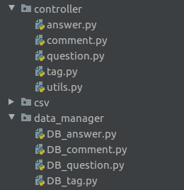
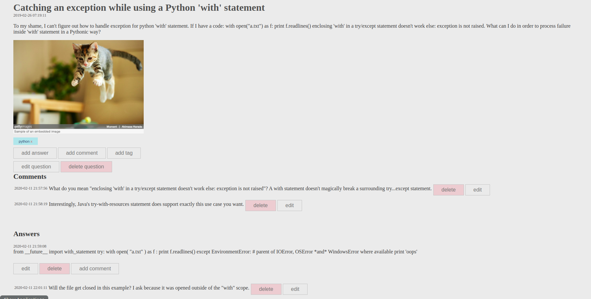
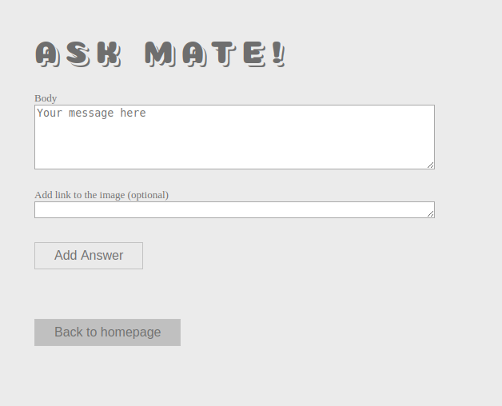

# Ask mate

Ask mate is a stack overflow like website.

##Features
- you can perform CRUD operations on questions, answers and comments
- you can add and delete tags
- you can add images
- MVC was pattern used 

##Tech stack 
- Flask
- PostgreSQL
- HTML & CSS 

##Clean code
All the modules have been named according to clean code rules.
Modules are named like that:

so you can use their methods like this:
question.add(form_data)
answer.add(form_data, question_id) 

which greatly increase readability of code.

## Question view

## Add answer view
